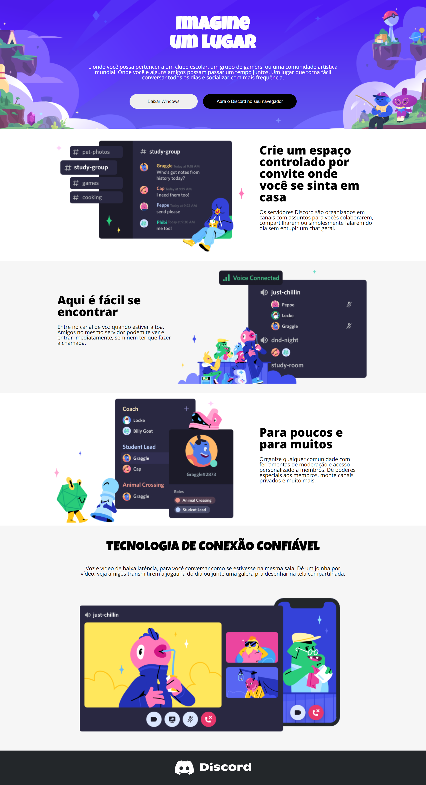

# Desafio DIO.me - Clonado site da Discord 

> Portifolio em programação

Projeto contruído na aula de CSS Developer administrada pela DIO e efetuando o clone do site da Discord com resposividade.

## Tecnologias

- HTML
- CSS
- GIT E GITHUB

## Contato
andersondlz2009@gmail.com